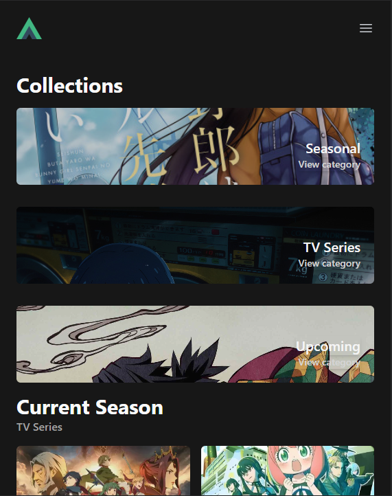

# **Another Anime Collection**

Website Project

- **สมาชิกกลุ่ม**
  - 6504101303 นายกฤษดา หดขุนทด
  - 6504101325 นายณัฏฐพล แก้วเลื่อน
  - 6504101369 นายภาณุวัฒน์ ประเสริฐ
  - 6504101383 นายวัชพล พลสุวรรณ
  - 6504101387 นายวีรวัฒน์ โพธิ์จวง

---

# **Introduction**

- เว็บโปรเจคนี้ทำมาเพื่อติดตามสถานะการดูอนิเมะหรือความคืบหน้า ให้คะแนนอนิเมะแต่ละเรื่อง และจัดการและติดตามได้ง่ายมากขึ้น

---

# **Idea**

- เนื่องจากว่าอนิเมะหรือการ์ตูนภาพเคลื่อนไหวในปัจจุบันมีจำนวนเยอะ การติดตามหลายๆเรื่องพร้อมกันจึงอาจจะทำให้ลืมได้
- เว็บไซต์ที่มีลักษณะคล้ายๆกันมีดีไซต์ที่เก่าและยากต่อการติดตาม
- ทำมาเพื่อเป็นเว็บไซต์ทางเลือกเพิ่มให้กับคนดูอนิเมะ

---

# **Features of the Website**

1. **ค้นหาอนิเมะ**
2. **ดูรายละเอียดของเรื่อง**
3. **รายการอนิเมะตามฤดูกาล**
4. **บุ๊กมาร์คอนิเมะที่ชื่นชอบ**
5. **แก้ไขโปรไฟล์ผู้ใช้**

---

# **ตามหาหรือค้นหาอนิเมะ**

ผู้ใช้สามารถคนหาอนิเมะจากการใส่ชื่อเรื่องหรือชื่อย่อ หรือค้นหาจากประเภทได้เช่น ซี่รี่ย์, หนัง หรือ ตอนพิเศษ


---

# **ดูรายละเอียดของเรื่อง**

ผู้ใช้สามารถดูรายละเอียดของอนิเมะตามเรื่องที่เลือกได้ เช่น ชื่อสตูดิโอผู้สร้าง, ฉายกี่ตอน, รายชื่อตัวละคร, วันที่ฉาย เป็นต้น


---

# **รายการอนิเมะตามฤดูกาล**

ผู้ใช้สามารถดู รายการอนิเมะที่ฉายในฤดูกาลนั้นๆได้ หรือเลือกฤดูกาลที่เคยฉายไปแล้วได้


---

# **บุ๊กมาร์คอนิเมะ**

ระบบบุ๊กมาร์คใช้สำหรับติดตามความคืบหน้าของอนิเมะที่ผู้ใช้เลือก และสามารถให้คะแนนรายการที่บุ๊กมาร์คไว้ได้


---

# **หน้าโปรไฟล์ผู้ใช้งาน**

ในหน้าโปรไฟล์ ผู้ใช้สามารถแก้ไขชื่อ, คำสรรพนาม, หรือคำอธิบาย, ดูสถิติอนิเมะที่ติดตามได้ เช่น กำลังดู, จบแล้ว, หรือเลิกดูแล้ว และการแก้ไขความคืบหน้าในหน้าไปรไฟล์นี้


---

# **Design UX/UI, Responsive**

เว็บไซต์ใช้ CSS Framework ของ Tailwind CSS ทำให้การออกแบบ Responsive ทำได้ง่ายขึ้น


---

# **Horizontal Design**

ใช้การดีไซต์แบบแนวนอนเมื่อเป็นจอของ Mobile

ตัวอย่างหน้า Home แบบ mobile

---

# **Navigation bar**

ใช้การดีไซต์ของ Tailwind UI


---

# **Resources อื่นๆ**

- HeadlessUI : components ต่างๆที่ใช้ร่วมกับ Tailwind
- Heroicons : แพ็คเกจไอคอน สร้างจากผู้สร้าง Tailwind

---

# **Coding**

**Technology Stack ที่ใช้**


- Vue.js 3
- VueRouter
- Pinia
- VueUse
- Axios
- Jikan API

---

# **โครงสร้าง Routing**

<style>
    .columns {
        display: flex; /* Use flexbox for two columns */
        justify-content: space-between; /* Create space between columns */
    }
    
    .column {
        width: 48%; /* Adjust the width of columns as needed */
        padding: 10px; /* Add padding to create space around content */
    }
</style>

<div class="columns">
<div class="column">

- Home
- Search
- Profile
- Anime : แสดงรายละเอียด
  - Id

</div>
<div class="column">

- Current : ฤดูกาลปัจจุบัน
- Upcoming
- Seasonal : ฤดูกาลตาม parameters
  - Year
  - Season
  </div>
  </div>

---

# **โครงสร้าง Pinia**

- userStore.js ใช้สำหรับเก็บข้อมูล bookmark ของผู้ใช้
- animeStore.js เก็บข้อมูลจาก api

---

# **VueUse**

คอลเล็คชั่นของเครื่องมือที่ใช้ทำงานกับ API ของ browser เช่น

- state
- network
- animation
- time

ในเว็บไซต์นี้จะใช้ useLocalStorage ในการเก็บข้อมูลบน Browser แบบ Local

---

# **ตัวอย่างเก็บข้อมูลผู้ใช้**

```js
const information = ref(
	useLocalStorage("vueUseUser", {
		displayName: "Anonymous",
		interest: "",
		bio: "",
		pronouns: "he/him",
	})
);
```

---

# **ปัญหา Rate limiting ของ API**

เนื่องจาก Jikan API เป็น public api การเรียกข้อมูลมาใช้เยอะเกินไปจะทำให้ถูกยกเลิกคำร้อง (Request) จึงต้องใช้การเก็บข้อมูลที่ใช้ซ้ำบางส่วนใน Pinia

---

# **ตัวอย่างโค้ดที่ดึงข้อมูลจาก Pinia**

```js
onMounted(() => {
	// load from pinia instead of fetching
	if (animeStore.season.current) {
		seasons.value = animeStore.season.current;
	} else {
		loadSeasons();
	}
});
```

ทุกครั้งที่มีการเปิดหน้าต่างจะเช็คข้อมูลว่ามีเก็บใน Pinia หรือไม่ทุกครั้ง

---

# **กรณีไม่สามารถเก็บใน Pinia ได้**

จะใช้การดีเลย์ 500ms ต่อ Request แทน

```js
const loadCurrent = async () => {
	const delay = (ms) => new Promise((resolve) => setTimeout(resolve, ms));
	const delayBetweenRequests = 500; // define delay 0.5 seconds

	const resTV = await axios.get("seasons/" + props.category, {
		baseURL: baseURL,
		params: { sfw: true, filter: "tv" },
	});

	await delay(delayBetweenRequests); // call delay function

	const resMovie = await axios.get("seasons/" + props.category, {
		baseURL: baseURL,
		params: { sfw: true, filter: "movie" },
	});
};
```

---

# Demo

https://anotheranime-collection.netlify.app/

---

## Thank you.

end of slide
